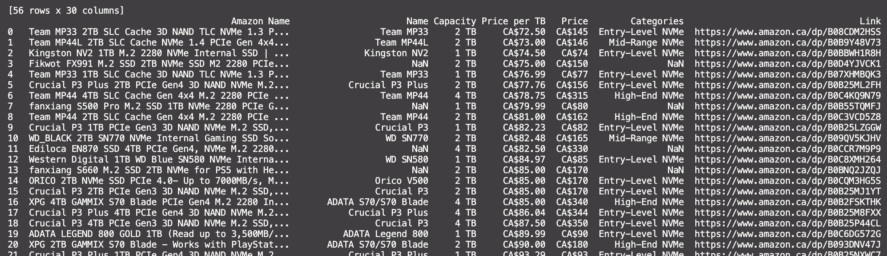

# ssd-prices

Pull SSD prices from diskprices.com, categories from NewMaxx's SSD spreadsheet,
and use gpt-4o to accurately match the two together.



## Run

You'll need `rye` to run this for now, since I can't be bothered to build an executable.

Afterwards, run `rye sync` and `rye run ssd-priced`

## Help

```
usage: ssd-prices [-h] [--api-key API_KEY] [--category CATEGORY [CATEGORY ...]] [--capacity CAPACITY [CAPACITY ...]]

options:
  -h, --help            show this help message and exit
  --api-key API_KEY     OpenAI API key
  --category CATEGORY [CATEGORY ...]
                        Categor(y|ies) to filter by. Valid options (for now) are 'Entry-Level NVMe', 'Mid-Range NVMe', and 'High-End NVMe'
  --capacity CAPACITY [CAPACITY ...]
                        Capacity to filter by. Valid options (for now) are '1 TB', '2 TB', and '4 TB'
```

## Future plans

- [ ] Find an effective fuzzy matcher / zero-shot classifier to avoid using gpt
